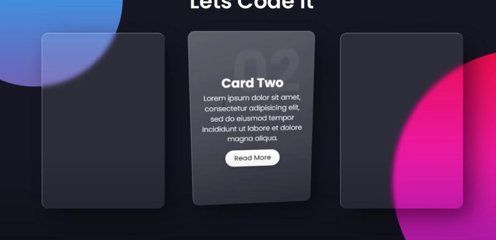
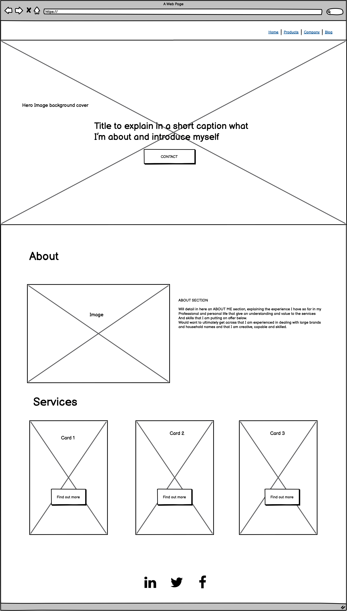

# MS1 Kayleigh Ellis Portfolio Website

[View the live site here](https://klellis.github.io/MS1-Ellis-Portfolio-Website/index.html)

I decided to build a portfolio website for my first project. It will be the main port of contact
for potential employers and collaboraters to find out more about what I do and get in touch. 
This means that a variety of people with different knowledge and backgrounds could be viewing the portfolio so I wanted to make the information as simplified as I could without selling myself short 
on my skills.

## Frameworks, Libraries & Programs Used

- [Bootstrap 5.0](https://https://getbootstrap.com/docs/5.0/getting-started/introduction/)
  - I used Bootstrap to help with the layout, particularly when it came to making the site more responsive on multiple screen sizes. It prevented me from having to complete media queries for every element.

- [Hover.css](https://https://ianlunn.github.io/Hover/)
  - Hover CSS was used on the icons that represented skills on the Services page as well as some movement to indicate that the scroll down icon in the Hero section of the Homepage is interactive.

- [Google Fonts](https://fonts.google.com)
  - The main font used throughout the project was 'Raleway' so I used Google Fonts to import this font into the style.css

- [GitHub](https://github.com)
  - GitHub is being used to both host my live site and store all my files and versions. 

- [VSCODE](https://code.visualstudio.com)
  - VS Code is used as my main IDE, as well as using the Terminal within it to commit to Git and push to GitHub.

- [Canva](https://canva.com)
  - Canva is an online tool that I used to edit images for use on my website. The images on my services.html were created in Canva, as well as my mockup image as featured at the top of this document. 

- [Balsamiq](https://balsamiq.com)
  - I created my wireframes within Balsamiq to give me a guide for my website before i started building it.

   ## Trends and Other Sources of Inspiration

###Neumorphism/Glassmorphism Trend
  - When I started thinking about this project I wanted to make sure that I included some of the latest trends in Web Design. These types of designs are very popular at the moment and I wanted to learn how to achieve some of these effects using only HTML and CSS just now

- [Here is a link](https://www.youtube.com/watch?v=hv0rNxr1XXk) to a youtube tutorial that I watched and took inspiration from to create the interactive cards on my Home Page.

### Wireframes

- Home page
  -