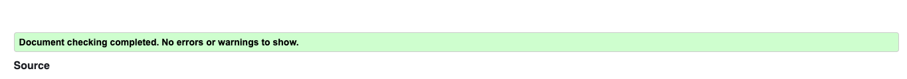
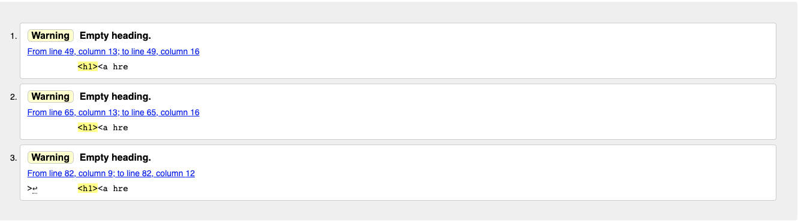
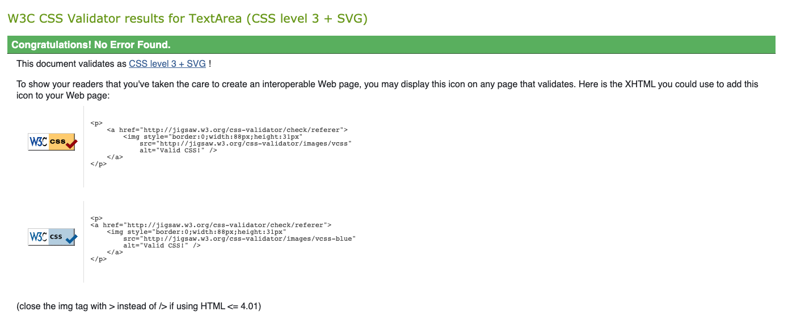
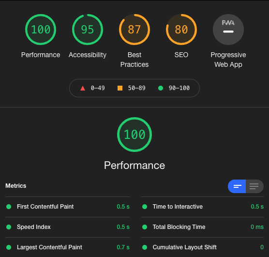
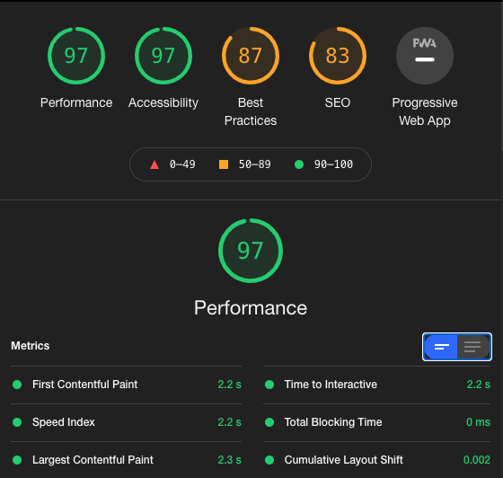

# MS1 Kayleigh Ellis Portfolio Website

[View the live site here](https://klellis.github.io/MS1-Ellis-Portfolio-Website/index.html)

This project was created for the purpose of my first Milestone Project toward my studies at Code Institute for the Level 5 Diploma in Web Application Development. 
The project is intended as a personal portfolio that displays my skills and experience and prompts the visitor to contact me with the intention for me attracting more work as a freelancer. This is not intended to be a digital CV but more of a business case for myself as a sole trader/agency.

## Frameworks, Libraries & Programs Used

- [Bootstrap 5.0](https://https://getbootstrap.com/docs/5.0/getting-started/introduction/)
  - I used Bootstrap to help with the layout, particularly when it came to making the site more responsive on multiple screen sizes. It prevented me from having to complete media queries for every element.

- [Hover.css](https://https://ianlunn.github.io/Hover/)
  - Hover CSS was used on the icons that represented skills on the Services page as well as some movement to indicate that the scroll down icon in the Hero section of the Homepage is interactive.

- [Google Fonts](https://fonts.google.com)
  - The main font used throughout the project was 'Raleway' so I used Google Fonts to import this font into the style.css

- [GitHub](https://github.com)
  - GitHub is being used to both host my live site and store all my files and versions. 

- [VSCODE](https://code.visualstudio.com)
  - VS Code is used as my main IDE, as well as using the Terminal within it to commit to Git and push to GitHub.

- [Canva](https://canva.com)
  - Canva is an online tool that I used to edit images for use on my website. The images on my services.html were created in Canva, as well as my mockup image as featured at the top of this document. 

- [Balsamiq](https://balsamiq.com)
  - I created my wireframes within Balsamiq to give me a guide for my website before i started building it.

- [UI Gradients](https://uigradients.com/#Memariani)
  - In some cases within my site I used UI Gradients, it gave me some ideas and inspiration for colour themes and I could quickly and easily try out a gradient and switch it out for another one. I'd find one of their gradients that was similar to the colour scheme I was going for and then alter it to suit my site. 

   ## Trends and Sources of Inspiration

###Neumorphism/Glassmorphism Trend
  - When I started thinking about this project I wanted to make sure that I included some of the latest trends in Web Design. These types of designs are very popular at the moment and I wanted to learn how to achieve some of these effects using only HTML and CSS just now given the stage that Im currently at in my learning journey. I

- [Here is a link](https://www.youtube.com/watch?v=hv0rNxr1XXk) to a youtube tutorial that I watched and took inspiration from to create the interactive cards on my Home Page. This tutorial included Javascript , which I chose not to include and I then adapted what I had learned to create my own.

### Wireframes

- Home page
  [Desktop](assets/images/MS1-Ellis-Portfolio-Homepage-Wireframe-Desktop.png)
  [Tablet/Mobile](assets/images/MS1-Ellis-Portfolio-Homepage-Wireframe-Tablet-Mobile.png)

- Services 
  [Desktop](MS1-Ellis-Portfolio-Services-Wireframe-Desktop.png)
  [Tablet/Mobile](MS1-Ellis-Portfolio-Services-Wireframe-Tablet-Mobile.png)

- Contact
   [Desktop](MS1-Ellis-Portfolio-Contact-Wireframe-Desktop.png)
 ## UX And UI
- The Homepage directs a user to either find out a little more about the services on offer or to get in contact. 
Ultimately, I wanted the Services and About sections to give the user confidence that I am a skilled professional without giving too much away. Therefore, all information on the site should prompt the user to want to get in touch and ask more questions/enquire. 

###Simple and Interactive
  - I wanted my site structure and overall design to be simple and add the details on the smaller elements that encourage interactivity, rather than overload the site with lots of animations unneccesarily. 
  Everything that is clickable on the site is interactive in some way, and everything that is not should remain static so as not to confuse the user. The only exception to this is the animated icons on the Services page to add a little more movement to the page. 

  - The first piece on interactivity is in the HERO banner on the home page. Having a static image didn't feel enough so i added a simple **parallax** effect to the background image simply by adding the position as fixed, centred, no repeat. This gives a nice feeling of more space on the page when scrolling. I also added a direct Call to action to the contact page as soon as the User enters the site so that if all they wanted to do was get in touch, its easily accessible, as well as prompting the user to scroll down via the animated chevron which links down to the about section.
  

  - Service Cards - These are the most interactive element on the page purposefully, as I wanted the User to click on them to find out more.I first created the 'glassmorphic' style cards on their own and then decided that they looked too 'corporate' or lacking some colour compared to what I wanted to create. I then set about learning how to create shapes using the border radius. The next task was then to generate movement. 
  I achieved this by altering the position of the shapes before, after and on hover. 
  

  - Social Links 
  My footer is very simple so I needed to add something a little more interesting to maintain user attention.
  I also altered the colour of the Social Icons, so that they were still recognisable as their own brand, but also matched the theme of my site. 
  To make them more interactive, I added a border around the social Icons that appears on hover with a box shadow depicting the colour of the icon

  

- I encountered a number of other small bugs during the process of building this site. I did however manage to solve and fix them as they were minor, and with a little bit more attention to detail and checking closing tags things ended up fine. 

## Testing 

- Throughout the project I used Google Developer Tools for testing the responsiveness of my project. It also helped me identify styling issues.

- This project has been tested on an iMac, iPhone X, Google Pixel 2XL and an iPad Pro. Functionality and design features were as expected on all of those devices and encountered no issues with responsiveness or styling.

### Bugs 

- The Interactive cards on the Home Page index.html were succesful in what I wanted to achieve 
however when it came to testing I used a number of different browsers and i have found that on Safari 
the cards are not appearing in the way I was hoping (during build I was using Google Chrome)
The boxes around the shapes seem more prominent on Safari and should not be visible. 
My thoughts are that it is something to do with how different browsers interpret the colours/shadows within the cards, and I will need to add some more lines of CSS for these browsers to interpret it in the way I intended but I have not yet figured out how to fix this.

### Code Validation
Having passed the html pages through the W3C validator and receiving some errors, I fixed these errors and returned a pass on all three pages, minus a warning on the Services page. This is due to me putting the icons inside an H1 tag to size them appropriately, the validator reads this as empty H1's.

The W3C CSS validator passed first time.

### Performance 
Desktop 

Mobile

#Deployment

This project is deployed using GitHub Pages. My main workspace was VS Code where I would commit my changes to the Git version control system, and push to GitHub. 

My site is published as: https://klellis.github.io/MS1-Ellis-Portfolio-Website/

If you'd prefer you can Clone or Fork my repository to your own GitHub